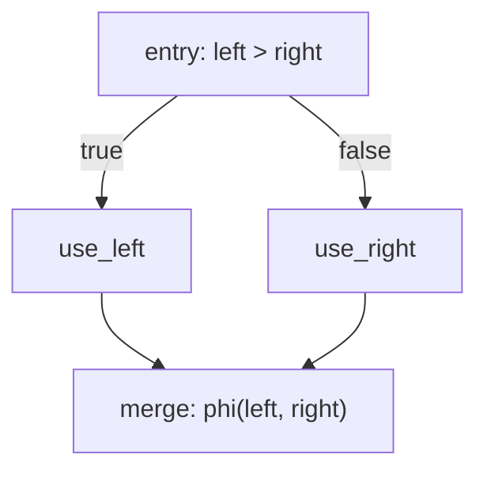

# How to build branching control flow

This guide shows you how to build an `if`-shaped control-flow diamond and return a value selected
by a PHI node. It assumes you can already create a builder, types, and a function declaration.

```typescript
import * as Effect from 'effect/Effect'
import * as Block from '@silklang/llvm/Block'
import * as Builder from '@silklang/llvm/Builder'
import * as FunctionActor from '@silklang/llvm/Function'
import * as FunctionBody from '@silklang/llvm/FunctionBody'
import * as Type from '@silklang/llvm/Type'
import * as Value from '@silklang/llvm/Value'

const program = Effect.gen(function* () {
  const builder = yield* Builder.make()
  const i32 = yield* Type.integer(builder, 32)
  const signature = yield* Type.functionType(builder, i32, [i32, i32])
  const fn = yield* FunctionActor.declare(builder, 'max', signature)

  yield* FunctionActor.buildBody(
    builder,
    fn,
    Effect.fn('Guide.maxBody')(function* (body) {
      // Create every block before the entry branch refers to them.
      const entry = yield* Block.make(body, 'entry')
      const useLeft = yield* Block.make(body, 'use_left')
      const useRight = yield* Block.make(body, 'use_right')
      const merge = yield* Block.make(body, 'merge')

      // Branch according to left > right.
      yield* Block.setInsertionPoint(body, entry)
      const left = yield* Value.argument(body, 0)
      const right = yield* Value.argument(body, 1)
      const condition = yield* FunctionBody.integerCompare(body, 'sgt', left, right, 'condition')
      yield* FunctionBody.conditionalBranch(body, condition, useLeft, useRight)

      // Both alternatives flow into the shared merge block.
      yield* Block.setInsertionPoint(body, useLeft)
      yield* FunctionBody.branch(body, merge)

      yield* Block.setInsertionPoint(body, useRight)
      yield* FunctionBody.branch(body, merge)

      // Pair each predecessor with the value it selected.
      yield* Block.setInsertionPoint(body, merge)
      const result = yield* FunctionBody.phi(body, i32, 'result')
      yield* FunctionBody.addPhiIncoming(body, result, left, useLeft)
      yield* FunctionBody.addPhiIncoming(body, result, right, useRight)
      yield* FunctionBody.returnValue(body, yield* FunctionBody.sealPhi(body, result))
    }),
  )

  return builder
})

const builder = await Effect.runPromise(program)
```

## Follow the control-flow graph



The example builds the graph in dependency order:

1. It creates all four blocks so the entry terminator can refer to both destinations.
2. It emits the comparison in `entry`; `conditionalBranch` then closes that block.
3. Both branch blocks jump to `merge`. Even though they contain no arithmetic, they are distinct
   predecessors and therefore need distinct PHI entries.
4. `addPhiIncoming` pairs `left` with `use_left` and `right` with `use_right`. `sealPhi` verifies
   that the PHI covers every predecessor before `returnValue` consumes it.

Create every destination block before emitting the conditional branch. Add one incoming value for
each predecessor, then call `sealPhi` before consuming the PHI result. Body validation rejects
unterminated blocks, missing PHI predecessors, duplicate incoming blocks, and instructions emitted
after a terminator.

The callback and its creating fiber own all blocks and local values. Do not return a body handle
for later mutation or use it from a forked fiber. Refer to
[Behavior and guarantees](../reference/behavior.md#function-body-transactions) for the ownership
rules.
