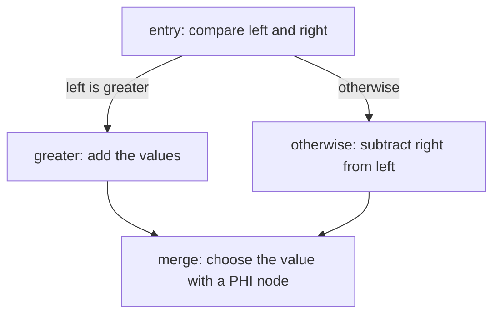

# Build a tiny expression compiler

In this tutorial, we will build a tiny compiler that lowers a conditional arithmetic expression
to LLVM IR. The finished program emits a `choose` function as readable LLVM assembly and as a
bitcode byte array whose first four bytes are LLVM's bitcode magic number.

The function will implement this expression:

```text
if left > right then left + right else left - right
```

Its LLVM body will have four blocks:



This tutorial follows the incremental spirit of LLVM's
[Kaleidoscope tutorial](https://llvm.org/docs/tutorial/MyFirstLanguageFrontend/), but starts at the
lowering stage. Parsing, JIT execution, optimization, and object-code generation are outside this
package's runtime scope.

## Prerequisites

Start from a checkout of this repository with Node.js 22.13 or newer and pnpm 11 installed. The
tutorial assumes basic TypeScript and familiarity with `Effect.gen`; it does not assume experience
with this builder.

Install dependencies and build the package:

```sh
pnpm install
pnpm build
```

## Create a module

Create `packages/llvm/tiny-expression.ts`:

```typescript
import * as Effect from 'effect/Effect'
import * as Builder from '@silk-effect/llvm/Builder'
import * as IrText from '@silk-effect/llvm/IrText'

const program = Effect.gen(function* () {
  const builder = yield* Builder.make({
    moduleName: 'tiny-expression',
    sourceFilename: 'tiny.expr',
  })

  return yield* IrText.render(builder)
})

console.log(await Effect.runPromise(program))
```

Run it:

```sh
node --experimental-strip-types packages/llvm/tiny-expression.ts
```

The output should be:

```llvm
; ModuleID = 'tiny-expression'
source_filename = "tiny.expr"
```

The builder now owns one empty LLVM module. Notice that rendering is an Effect operation: invalid
or incomplete module state remains in the typed error channel.

## Lower the expression

Replace `tiny-expression.ts` with this complete program:

```typescript
import * as Effect from 'effect/Effect'
import * as Bitcode from '@silk-effect/llvm/Bitcode'
import * as Block from '@silk-effect/llvm/Block'
import * as Builder from '@silk-effect/llvm/Builder'
import * as FunctionActor from '@silk-effect/llvm/Function'
import * as FunctionBody from '@silk-effect/llvm/FunctionBody'
import * as IrText from '@silk-effect/llvm/IrText'
import * as Type from '@silk-effect/llvm/Type'
import * as Value from '@silk-effect/llvm/Value'

const program = Effect.gen(function* () {
  const builder = yield* Builder.make({
    moduleName: 'tiny-expression',
    sourceFilename: 'tiny.expr',
  })

  // Describe and declare: choose(i32, i32) -> i32.
  const i32 = yield* Type.integer(builder, 32)
  const signature = yield* Type.functionType(builder, i32, [i32, i32])
  const choose = yield* FunctionActor.declare(builder, 'choose', signature)

  yield* FunctionActor.buildBody(
    builder,
    choose,
    Effect.fn('TinyExpression.chooseBody')(function* (body) {
      // Create the complete control-flow shape before referring to its blocks.
      const entry = yield* Block.make(body, 'entry')
      const onGreater = yield* Block.make(body, 'greater')
      const otherwise = yield* Block.make(body, 'otherwise')
      const merge = yield* Block.make(body, 'merge')

      // Compare the arguments and choose one of the two arithmetic blocks.
      yield* Block.setInsertionPoint(body, entry)
      const left = yield* Value.argument(body, 0)
      const right = yield* Value.argument(body, 1)
      const condition = yield* FunctionBody.integerCompare(body, 'sgt', left, right, 'condition')
      yield* FunctionBody.conditionalBranch(body, condition, onGreater, otherwise)

      // Each alternative computes one candidate and then joins the merge block.
      yield* Block.setInsertionPoint(body, onGreater)
      const sum = yield* FunctionBody.binary(body, 'add', left, right, 'sum')
      yield* FunctionBody.branch(body, merge)

      yield* Block.setInsertionPoint(body, otherwise)
      const difference = yield* FunctionBody.binary(body, 'sub', left, right, 'difference')
      yield* FunctionBody.branch(body, merge)

      // Select the candidate associated with the predecessor that actually ran.
      yield* Block.setInsertionPoint(body, merge)
      const result = yield* FunctionBody.phi(body, i32, 'result')
      yield* FunctionBody.addPhiIncoming(body, result, sum, onGreater)
      yield* FunctionBody.addPhiIncoming(body, result, difference, otherwise)
      yield* FunctionBody.returnValue(body, yield* FunctionBody.sealPhi(body, result))
    }),
  )

  // Both encoders read the same committed module snapshot.
  return {
    text: yield* IrText.render(builder),
    bytes: yield* Bitcode.encode(builder),
  }
})

const output = await Effect.runPromise(program)
console.log(output.text)
console.log('bitcode magic:', [...output.bytes.slice(0, 4)])
```

### Read the lowering from top to bottom

The program is easier to follow as five small stages.

1. `Builder.make` creates one module owner. Everything created afterward—the type, function,
   blocks, and instruction results—belongs to this builder.
2. `Type.integer` creates `i32`. `Type.functionType` uses it to describe `i32 (i32, i32)`, and
   `Function.declare` adds the corresponding `choose` declaration to the module.
3. `Function.buildBody` opens a scoped body draft. The four `Block.make` calls create the labels
   shown in the diagram; `Block.setInsertionPoint` chooses which block receives the next
   instruction.
4. In `entry`, `Value.argument` retrieves the two parameters. `integerCompare` emits the `%condition`
   SSA value, and `conditionalBranch` terminates the block by selecting `greater` or `otherwise`.
5. Each branch computes one candidate and jumps to `merge`. The PHI node records which value came
   from which predecessor. `sealPhi` checks that every predecessor is covered before the result is
   returned.

Finally, `IrText.render` and `Bitcode.encode` take snapshots of the same committed module. The
first is useful for reading the result; the second is the binary representation a downstream LLVM
tool can consume.

Run the program again:

```sh
node --experimental-strip-types packages/llvm/tiny-expression.ts
```

The output should include:

```llvm
define i32 @choose(i32 %v0, i32 %v1) {
entry:
  %condition = icmp sgt i32 %v0, %v1
  br i1 %condition, label %greater, label %otherwise
greater:
  %sum = add i32 %v0, %v1
  br label %merge
otherwise:
  %difference = sub i32 %v0, %v1
  br label %merge
merge:
  %result = phi i32 [ %sum, %greater ], [ %difference, %otherwise ]
  ret i32 %result
}
```

The final line should be:

```text
bitcode magic: [ 66, 67, 192, 222 ]
```

Notice how the lowering follows the expression's shape. The comparison creates an SSA value, the
conditional branch chooses a block, and the PHI instruction produces one result from the two
predecessors.

## Check the failure boundary

Delete the `FunctionBody.branch(body, merge)` call from the `otherwise` block and run the program.
The Effect should fail with a `LlvmError` whose `operation` identifies body validation and whose
`reason._tag` is `InvalidState`, reporting that the block lacks a terminator. You can recover with
`Effect.catchTag('LlvmError', ...)` without catching defects. Restore the branch before continuing.

The failed body is not partially committed. `Function.buildBody` validates and commits the whole
draft as one scoped transaction, closes it on every exit, and releases the reservation so a retry
can build the function successfully.

## What you built

You started with an empty module, declared a typed function, lowered a conditional expression into
four basic blocks, joined two SSA values with a PHI node, and emitted the same module as LLVM text
and bitcode. You can now use the [control-flow how-to](../how-to/control-flow.md) when applying the
same pattern in a real frontend.
