# Build Tiny, a compiled language: Meet Tiny

**Lesson 1 of 13** · [Documentation home](../../README.md)

In this tutorial series, you will build Tiny: a small expression language implemented with
TypeScript and Effect. You will take it from source text through a lexer, parser, abstract syntax
tree, name resolution, and LLVM lowering. At the end, Clang will turn the generated LLVM IR into a
native executable that runs a function written in Tiny.

After completing the series, you will be able to build and extend a small compiler rather than
only reproduce one LLVM expression.

## Who this is for

This series is for TypeScript developers who are comfortable with `Effect.gen` and curious about
how compilers work. You do not need prior compiler or LLVM experience.

The complete tutorial takes roughly two to three hours. Later lessons use Node.js 22.13 or newer,
pnpm 11, and LLVM/Clang 22. Lesson 3 will walk through the complete project setup before you write
compiler code.

Every required source file, command, expected result, and recovery step will appear in the written
tutorial. A future browser playground may make the compiler easier to explore, but no lesson will
depend on it.

## The language you will build

The completed compiler will accept this Tiny program:

```text
fn abs(x) = if x < 0 then -x else x

fn score(x, y) = abs(x - y) * 3 + 2

fn main() = score(4, 10)
```

This is a small language, but it has the pieces needed to feel like one:

- integer literals and named parameters;
- user-defined functions and function calls;
- parentheses, unary negation, and arithmetic with precedence;
- comparisons and expression-valued `if/then/else`;
- forward function calls and recursion; and
- typed errors from source text through LLVM construction.

All Tiny values are signed 32-bit integers. The final program computes the absolute difference
between `4` and `10`, multiplies it by `3`, adds `2`, and returns `20` from `main`.

After generating `score.ll` and compiling it, you will run:

```sh
./build/score
echo $?
```

The observable result will be:

```text
20
```

The exit status is our deliberately small observation mechanism. Tiny will not need printing, a
standard library, or a JIT to prove that its own functions ran.

## Follow one program through the toolchain

```mermaid
flowchart LR
  source["Tiny source (.tiny)"] --> lexer["Tiny frontend: lexer"]
  lexer --> tokens["Tokens"]
  tokens --> parser["Tiny frontend: parser"]
  parser --> ast["Abstract syntax tree"]
  ast --> lowering["Tiny frontend: resolution and lowering"]
  lowering --> builder["@silk-lang/llvm: construct and validate a module"]
  builder --> ir["Textual LLVM IR (.ll)"]
  ir --> clang["Clang: target compilation and linking"]
  clang --> executable["Native executable"]
  executable --> os["Operating system: load and run"]
  os --> result["Exit status 20"]
```



In text, the same path is:

1. You write a `.tiny` source file.
2. The Tiny lexer groups its characters into tokens.
3. The Tiny parser arranges those tokens into an abstract syntax tree, or AST.
4. The Tiny compiler resolves names and lowers the AST into typed LLVM operations.
5. `@silk-lang/llvm` constructs, validates, and renders an LLVM module as readable `.ll` text.
6. Clang compiles and links that IR for the current machine.
7. The operating system loads the native executable, runs `main`, and records status `20`.

The important boundary is already visible: LLVM does not know Tiny's grammar. The frontend you
build decides what Tiny means and translates that meaning into LLVM IR.

## Preview the intermediate artifacts

You do not need to understand these representations yet. Each one will become the visible result
of a later lesson.

The lexer will turn source such as:

```text
fn main() = score(4, 10)
```

into a token stream shaped like:

```text
fn identifier ( ) = identifier ( integer , integer ) end-of-file
```

The parser will arrange the final function into a tree shaped like:

```text
Function main
└── Call score
    ├── Integer 4
    └── Integer 10
```

The generated LLVM module will eventually include a function shaped like:

```llvm
define i32 @main() {
entry:
  %result = call i32 @score(i32 4, i32 10)
  ret i32 %result
}
```

The AST fixes the calculation's structure. LLVM IR expresses that structure with typed functions,
values, and control flow. Clang then handles the machine-specific work. Lesson 2 will introduce
these LLVM concepts carefully before you generate any IR yourself.

## Know who owns each part

| Owner | Responsibility in this tutorial |
| --- | --- |
| You and the Tiny frontend | Define Tiny syntax and meaning; lex, parse, resolve, and lower it. |
| `@silk-lang/llvm` | Construct and validate the LLVM module; emit textual IR or bitcode. |
| Clang | Compile the emitted IR for the host target and link a native executable. |
| The operating system | Load the executable, run `main`, and expose its exit status. |

`@silk-lang/llvm` intentionally does not read your source file, run Clang, link an executable,
or provide a JIT. Those boundaries keep the package deterministic and let the tutorial show each
compiler stage explicitly.

## Checkpoint: match each artifact to its stage

Before continuing, match each artifact with the stage that first produces it:

1. `.tiny` source
2. token stream
3. AST
4. `.ll` LLVM IR
5. native object code and linked executable
6. exit status

Stages:

- operating system
- parser
- author
- Clang
- lexer
- Tiny lowering with `@silk-lang/llvm`

<details>
<summary>Check your answer</summary>

1. The author produces `.tiny` source.
2. The lexer produces the token stream.
3. The parser produces the AST.
4. Tiny lowering uses `@silk-lang/llvm` to produce `.ll` LLVM IR.
5. Clang produces native object code and the linked executable.
6. The operating system exposes the program's exit status.

</details>

If you expected LLVM to produce the token stream or AST, trace this smaller program:

```text
fn main() = 20
```

The Tiny lexer recognizes the characters `2` and `0` as one integer token. The Tiny parser creates
an integer-expression node. Tiny's lowering translates that node into an LLVM `i32` constant and
a return instruction. LLVM only receives the result of that translation: `ret i32 20`.

## Tutorial map

Available now:

1. **Meet Tiny and follow the compilation pipeline** — this lesson.
2. [Understand LLVM's role and read basic IR](./02-understand-llvm.md).
3. [Create the consumer project and render a module](./03-consumer-setup.md).
4. [Tokenize Tiny source](./04-tokenize-source.md).
5. [Build an AST and resolve arithmetic precedence](./05-precedence-ast.md).
6. [Parse complete Tiny programs](./06-parse-programs.md).
7. [Lower and run `fn main() = 42`](./07-first-native-program.md).
8. [Lower arithmetic and learn SSA](./08-ssa-expressions.md).
9. [Resolve functions and lower calls](./09-functions-calls.md).
10. [Lower `if` with control flow and PHI nodes](./10-conditionals-phi.md).
11. [Compile and run the complete language](./11-complete-compiler.md).
12. [Diagnose failures and understand bitcode](./12-diagnostics-bitcode.md).
13. [Extend Tiny with `%` and consolidate what you learned](./13-extend-remainder.md).

After the series, try the recursive factorial fixture, add another small operator, or build the
optional compile-only playground described in Lesson 13. The written tutorial and compiler remain
fully usable without a playground or server.

If you already know how compiler frontends work and only want a focused package walkthrough, use
[Build a tiny expression compiler](../tiny-expression-compiler.md). It starts directly at LLVM
lowering.

Next: [Lesson 2 — Understand LLVM's role and read basic IR](./02-understand-llvm.md).
