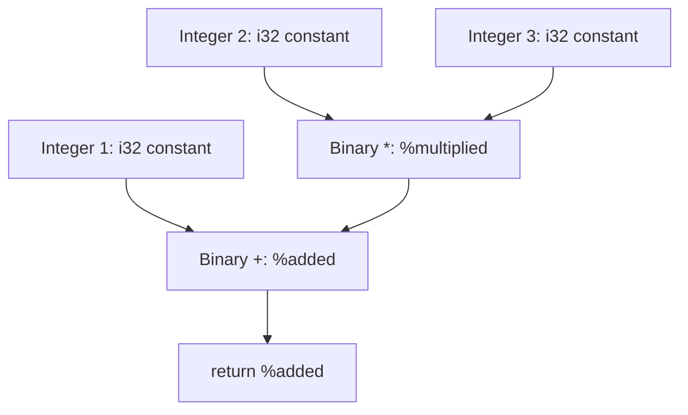

# Build Tiny, a compiled language: Lower expressions into SSA values

**Lesson 8 of 13** · [Previous: Run the first native program](./07-first-native-program.md) ·
[Next: Resolve functions and calls](./09-functions-calls.md)

In this lesson, we will replace the compiler's literal-only body with recursive expression
lowering. Arithmetic AST nodes will become typed LLVM instructions, comparisons will become Tiny
integers, and the generated names will give us a concrete introduction to static single
assignment form, usually called SSA.

## Read SSA names as values, not variables

In a mutable source language, one name can describe different values over time:

```text
x = 1
x = x + 2
x = x * 3
return x
```

An SSA-style spelling gives every produced value a distinct name and assigns each name once:

```text
x0 = 1
x1 = x0 + 2
x2 = x1 * 3
return x2
```

Tiny has no assignment, so we do not need to transform mutable variables. The comparison is still
useful: when LLVM prints `%multiplied` or `%added`, each name identifies one immutable instruction
result. It is not a storage slot whose contents later change.

LLVM instructions are also typed. In `%added = add i32 1, %multiplied`, both inputs and the result
are `i32`. The instruction dependency says `%multiplied` must exist before `%added` can use it.
The AST has already decided the calculation's structure; SSA names expose the intermediate values
created while lowering that structure.

## Give recursive lowering a small context

In `Compiler.ts`, import the public `Value` type and the expression actor, then add:

```typescript
interface LoweringContext {
  readonly builder: Builder.Builder
  readonly body: FunctionBody.FunctionBody
  readonly i32: Type.Type
}
```

The builder creates module constants, the body receives instructions, and `i32` is Tiny's only
language-level type. Pass this context down the recursion instead of introducing module globals.

Add a private named recipe:

```typescript
const lowerExpression = Effect.fnUntraced(function* (
  context: LoweringContext,
  expression: Expression.Expression,
): Effect.fn.Return<Value.Input, Diagnostic.CompileError | LlvmError.LlvmError> {
  // one case for each expression shape introduced so far
})
```

`Value.Input` is the shared operand type accepted by instruction builders. It can be either a
module constant or a function-local SSA value, so callers do not need their own wrapper hierarchy.

## Lower literals, negation, and arithmetic

The integer case still uses `Constant.integerSigned`. The unary case recursively lowers its
operand and passes the result to `FunctionBody.negate`. For a binary node, lower the left and right
children first, then append the matching instruction.

| Tiny operator | LLVM operation          | Why                                                         |
| ------------- | ----------------------- | ----------------------------------------------------------- |
| unary `-`     | `FunctionBody.negate`   | Subtracts the operand from a same-typed zero                |
| `+`           | `add`                   | Signed and unsigned addition share this instruction         |
| `-`           | `sub`                   | Signed and unsigned subtraction share this instruction      |
| `*`           | `mul`                   | Signed and unsigned multiplication share this instruction   |
| `/`           | `sdiv`                  | Tiny integers are signed and division truncates toward zero |
| `<`           | `icmp slt`, then `zext` | Signed less-than, normalized from `i1` to `i32`             |
| `>`           | `icmp sgt`, then `zext` | Signed greater-than, normalized from `i1` to `i32`          |

For example, the addition case is:

```typescript
return yield * FunctionBody.binary(context.body, 'add', left, right, 'added')
```

Do not add `nsw`, `nuw`, or `exact` promises. Tiny has not defined an overflow policy that would
justify no-wrap flags, and attaching an invalid promise can let later optimization change program
behavior.

For AST variants not lowered yet—names, calls, and conditionals—yield a source-spanned
`CompileError`. We will remove those temporary rejections in the next two lessons.

## Follow one AST into SSA

The parser gives `1 + 2 * 3` this tree:

```text
Binary +
├── Integer 1
└── Binary *
    ├── Integer 2
    └── Integer 3
```

Lowering follows the dependencies from the leaves upward:



In text: constants `2` and `3` feed `%multiplied`; constant `1` and `%multiplied` feed `%added`;
`%added` feeds the return terminator.

The rendered IR is:

```llvm
define i32 @main() {
entry:
  %multiplied = mul i32 2, 3
  %added = add i32 1, %multiplied
  ret i32 %added
}
```

The printed order agrees with the dependencies, but it did not invent arithmetic precedence. The
AST from Lesson 5 already placed multiplication inside addition.

## Normalize comparisons to Tiny's one type

LLVM comparisons produce `i1`, a one-bit integer. Tiny promises that every expression is `i32`, so
returning that `i1` directly would violate both the language contract and `main`'s signature.

Lower `<` and `>` in two steps:

```typescript
const comparison =
  yield *
  FunctionBody.integerCompare(
    context.body,
    expression.operator === '<' ? 'slt' : 'sgt',
    left,
    right,
    'comparison',
  )
return yield * FunctionBody.cast(context.body, 'zext', comparison, context.i32, 'comparison_i32')
```

Zero extension maps false to `i32 0` and true to `i32 1`. For `-1 < 0`, the checkpoint IR is:

```llvm
%negated = sub i32 zeroinitializer, 1
%comparison = icmp slt i32 %negated, 0
%comparison_i32 = zext i1 %comparison to i32
ret i32 %comparison_i32
```

`zeroinitializer` is LLVM's printed constant spelling for the same-typed zero created by
`FunctionBody.negate`.

## Run the expression checkpoints

Change the source string in `Cli.ts`, regenerate the IR with `pnpm --silent smoke`, compile with
LLVM 22 Clang as in Lesson 7, and inspect each exit status:

| Tiny `main` body | Important IR                 |           Exit status |
| ---------------- | ---------------------------- | --------------------: |
| `1 + 2 * 3`      | `mul` before dependent `add` |                     7 |
| `-20 / 3`        | `sub` from zero, then `sdiv` | 250 (`-6` modulo 256) |
| `-1 < 0`         | `icmp slt`, then `zext`      |                     1 |
| `2 > 3`          | `icmp sgt`, then `zext`      |                     0 |

Add compiler tests that assert these instruction shapes and run:

```sh
pnpm typecheck
pnpm test
```

There should now be sixteen consumer tests. If arithmetic IR is reversed, inspect the AST before
the compiler; lowering should simply recurse into its left and right children. If division uses
`udiv`, change it to `sdiv`. If a comparison cannot be returned from `main`, confirm the `i1`
result passes through `zext` to the same builder-owned `i32` used by the function signature.

We have intentionally stopped short of PHI nodes and formal dominance rules. Straight-line
expressions need neither. Lesson 10 will introduce the extra SSA machinery exactly when branches
make it necessary. First, Lesson 9 will resolve parameter names and function calls.

[Previous: Run the first native program](./07-first-native-program.md) ·
[Next: Resolve functions and calls](./09-functions-calls.md)
