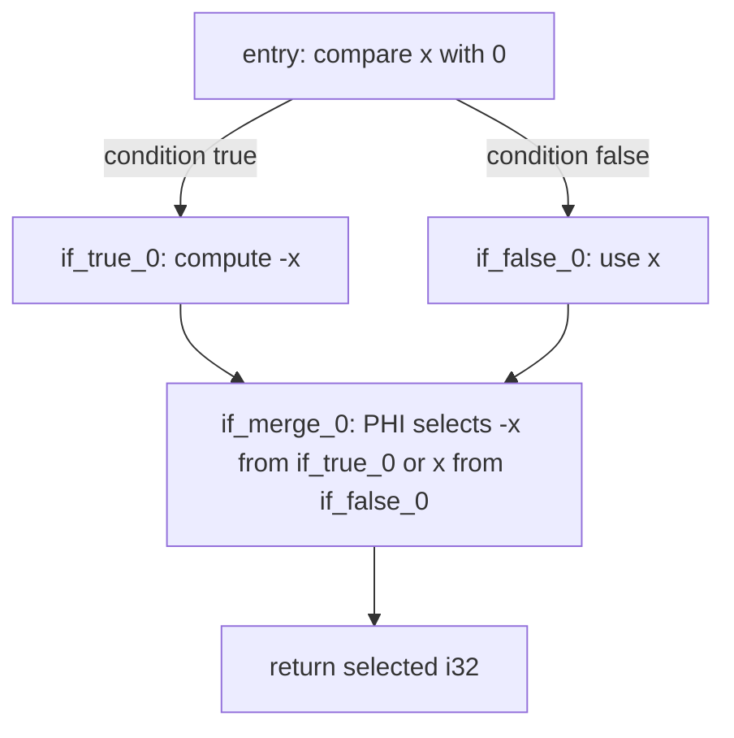

# Build Tiny, a compiled language: Lower conditionals with PHI nodes

**Lesson 10 of 13** · [Previous: Resolve functions and calls](./09-functions-calls.md) ·
[Next: Compile the complete program](./11-complete-compiler.md)

In this lesson, we will lower Tiny's expression-valued `if` into a control-flow graph. Each branch
will compute an `i32`, and a PHI instruction in the merge block will select the value associated
with the predecessor block that actually ran.

This is the point where SSA becomes more than naming straight-line results.

## Turn Tiny truthiness into LLVM's branch type

Every Tiny expression produces `i32`, including comparisons normalized in Lesson 8. LLVM's
`conditionalBranch` requires `i1`. Tiny defines zero as false and every nonzero value as true, so
lower the condition, compare it with an `i32` zero, and branch on the comparison:

```typescript
const condition = yield * lowerExpression(context, expression.condition)
const zero = yield * Constant.integerSigned(context.builder, context.i32, 0)
const branchCondition =
  yield *
  FunctionBody.integerCompare(context.body, 'ne', condition, zero, freshName(context, 'condition'))
```

`icmp ne` returns the required `i1`. We do not change Tiny's expression type; this conversion lives
only at the LLVM branch boundary.

## Track readable, unique lowering state

Nested conditionals need unique block labels. Repeated arithmetic also needs unique SSA names
within one function. Extend the per-body lowering context with:

```typescript
currentBlock: Block.Block
nextBlock: number
nextValue: number
```

Initialize `currentBlock` with the entry block and both counters with zero. Add a private
`freshName` that returns `${base}_${nextValue}` and increments the counter.

For each `if`, reserve one block number and create all destinations before emitting the branch:

```typescript
const blockId = context.nextBlock
context.nextBlock += 1
const onTrueBlock = yield * Block.make(context.body, `if_true_${blockId}`)
const onFalseBlock = yield * Block.make(context.body, `if_false_${blockId}`)
const mergeBlock = yield * Block.make(context.body, `if_merge_${blockId}`)
yield * FunctionBody.conditionalBranch(context.body, branchCondition, onTrueBlock, onFalseBlock)
```

An LLVM basic block is a straight-line instruction sequence with one terminator. The conditional
branch terminates the block that evaluated the condition and adds it as a predecessor of both
destination blocks.

## See the control-flow graph

For `if x < 0 then -x else x`, lowering creates this graph:



In text: `entry` branches to either `if_true_0` or `if_false_0`; both branch to `if_merge_0`;
the merge returns one value chosen according to the block that reached it.

A predecessor is simply a block with an outgoing edge into another block. Here, the merge's two
predecessors are the true and false blocks.

## Lower each branch at its insertion point

Move to the true block, update `currentBlock`, lower the true expression, remember the block where
that lowering ended, and terminate it with a branch to the merge. Repeat for the false expression:

```typescript
yield * Block.setInsertionPoint(context.body, onTrueBlock)
context.currentBlock = onTrueBlock
const onTrue = yield * lowerExpression(context, expression.onTrue)
const onTruePredecessor = context.currentBlock
yield * FunctionBody.branch(context.body, mergeBlock)

yield * Block.setInsertionPoint(context.body, onFalseBlock)
context.currentBlock = onFalseBlock
const onFalse = yield * lowerExpression(context, expression.onFalse)
const onFalsePredecessor = context.currentBlock
yield * FunctionBody.branch(context.body, mergeBlock)
```

Remembering the actual ending block matters for nesting. If the true expression is another `if`,
it ends at its inner merge, not at the outer `if_true` block. The outer PHI must name that inner
merge as its incoming predecessor.

Every instruction result is available only where control flow guarantees it has been computed.
At a beginner level, that is the useful dominance intuition: a value can be used only in places
that cannot be reached without passing through its definition. A true-branch value does not
dominate the outer merge because the false path skips it; the PHI makes that path-dependent choice
explicit.

## Merge the two expression values

Move to the merge block, create an `i32` PHI, add one incoming pair for each actual predecessor,
and seal it:

```typescript
yield * Block.setInsertionPoint(context.body, mergeBlock)
context.currentBlock = mergeBlock
const phi = yield * FunctionBody.phi(context.body, context.i32, freshName(context, 'if_result'))
yield * FunctionBody.addPhiIncoming(context.body, phi, onTrue, onTruePredecessor)
yield * FunctionBody.addPhiIncoming(context.body, phi, onFalse, onFalsePredecessor)
return yield * FunctionBody.sealPhi(context.body, phi)
```

A PHI is not an imperative assignment and it does not execute both branches. It says: if control
arrived from predecessor A, use A's value; if it arrived from predecessor B, use B's value.
`sealPhi` validates that every predecessor has exactly one same-typed incoming value.

## Walk through `abs`

Compile:

```text
fn abs(x) = if x < 0 then -x else x
fn main() = abs(-3)
```

The important body is:

```llvm
define i32 @abs(i32 %v0) {
entry:
  %comparison_0 = icmp slt i32 %v0, 0
  %comparison_i32_1 = zext i1 %comparison_0 to i32
  %condition_2 = icmp ne i32 %comparison_i32_1, 0
  br i1 %condition_2, label %if_true_0, label %if_false_0
if_true_0:
  %negated_3 = sub i32 zeroinitializer, %v0
  br label %if_merge_0
if_false_0:
  br label %if_merge_0
if_merge_0:
  %if_result_4 = phi i32 [ %negated_3, %if_true_0 ], [ %v0, %if_false_0 ]
  ret i32 %if_result_4
}
```

If `x < 0`, execution reaches the merge from `%if_true_0`, so the PHI selects `%negated_3`. If the
comparison is false, execution arrives from `%if_false_0`, so the PHI selects `%v0`.

Compile and run the full module with LLVM 22 Clang. `abs(-3)` returns exit status `3`.

## Verify nesting and factorial

Add a nested checkpoint:

```text
fn main() = if 1 then if 0 then 2 else 3 else 4
```

The inner blocks use suffix `1`, while the outer blocks use `0`. Its outer PHI must include:

```llvm
%if_result_3 = phi i32 [ %if_result_2, %if_merge_1 ], [ 4, %if_false_0 ]
```

The true incoming predecessor is `%if_merge_1`, not `%if_true_0`, because the nested conditional
ended in its own merge. The executable returns `3`.

The factorial fixture from Lesson 9 now compiles too. Its recursive branch and merge include:

```llvm
%called_4 = call i32 @factorial(i32 %subtracted_3)
%multiplied_5 = mul i32 %v0, %called_4
br label %if_merge_0
if_merge_0:
%if_result_6 = phi i32 [ 1, %if_true_0 ], [ %multiplied_5, %if_false_0 ]
```

Compile `factorial(5)` and run it. The exit status is `120`.

Add IR tests for `abs`, nesting, and factorial, then run typecheck and all tests. There should be
twenty-two passing consumer tests.

If `conditionalBranch` rejects the condition, verify that the `i32` Tiny value was compared with
zero and that you passed the resulting `i1`. If body validation reports an unterminated block,
ensure both branch-ending blocks call `FunctionBody.branch`. If `sealPhi` reports missing or extra
incoming edges, compare its pairs to `Block.predecessors(merge)`. If instructions appear in the
wrong block, update both the insertion point and `currentBlock` together, including after a nested
merge.

Tiny's expression forms now all lower to LLVM. Next, we will connect source-file input to the
compiler, emit the final `score.ll`, compile it with Clang, and run the complete three-function
language program from Lesson 1.

[Previous: Resolve functions and calls](./09-functions-calls.md) ·
[Next: Compile the complete program](./11-complete-compiler.md)
